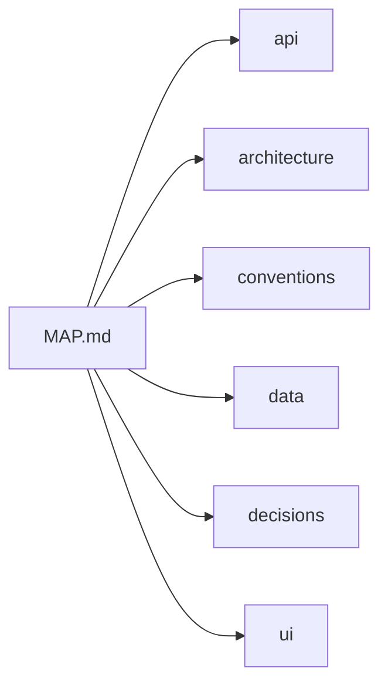

# ShareLane context map

> Generated from chunk headers. Edit a chunk through ShareLane instead of editing this index by hand.

## Project

**sharelane** — A shared project memory and delegation hub for coding agents.

## How to use this map

Read only the chunks relevant to your task. After meaningful work, update the affected chunks so the next agent receives fresh context.

## Context chunks

| Chunk | Read this when… | Covers files | Updated at | Status |
|---|---|---|---|---|
| [API and tools](./api.md) | You are changing commands, tools, integrations, or public interfaces. | Not set yet | 2026-09-26T20:41:18.545Z | current |
| [Architecture](./architecture.md) | Understanding ShareLane components and data flow. | `src/**` | 2026-09-26T20:48:34.060Z | current |
| [Project conventions](./conventions.md) | You need the project's coding, testing, or collaboration rules. | Not set yet | 2026-09-26T20:41:18.547Z | current |
| [Data and storage](./data.md) | You are changing stored data, schemas, migrations, or persistence. | Not set yet | 2026-09-26T20:41:18.546Z | current |
| [Project decisions](./decisions.md) | You need to know why an important choice was made. | Not set yet | 2026-09-26T20:41:18.548Z | current |
| [User interface](./ui.md) | You are changing screens, interactions, or visual behavior. | Not set yet | 2026-09-26T20:41:18.543Z | current |

## Context map

