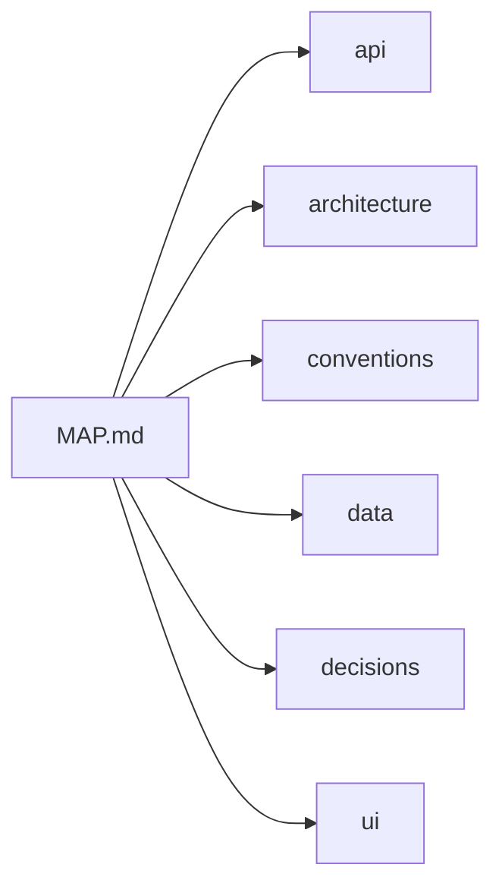

# ShareLane context map

> Generated from chunk headers. Edit a chunk through ShareLane instead of editing this index by hand.

## Project

**sharelane** — A shared project memory and delegation hub for coding agents.

## How to use this map

Read only the chunks relevant to your task. After meaningful work, update the affected chunks so the next agent receives fresh context.

## Context chunks

| Chunk | Read this when… | Covers files | Updated at | Status |
|---|---|---|---|---|
| [API and tools](./api.md) | Changing commands, MCP tools, integrations, or public interfaces. | `src/mcp/**`, `src/cli.ts` | 2026-09-26T20:50:48.713Z | current |
| [Architecture](./architecture.md) | Understanding ShareLane components and data flow. | `src/**` | 2026-09-26T20:50:48.371Z | current |
| [Project conventions](./conventions.md) | Following the project's coding, testing, documentation, or collaboration rules. | `AGENTS.md`, `CLAUDE.md`, `package.json`, `tsconfig.json` | 2026-09-26T20:50:49.943Z | current |
| [Data and storage](./data.md) | Changing stored data, schemas, search, migrations, or persistence. | `src/db/**`, `src/core/database.ts`, `src/core/context.ts`, `src/core/memory.ts` | 2026-09-26T20:50:49.184Z | current |
| [Project decisions](./decisions.md) | Understanding why a storage, context, or agent-integration choice was made. | `docs/DECISIONS.md` | 2026-09-26T20:50:50.766Z | current |
| [User interface](./ui.md) | Changing screens, interactions, dashboard behavior, or visual design. | Not set yet | 2026-09-26T20:50:51.726Z | current |

## Context map

