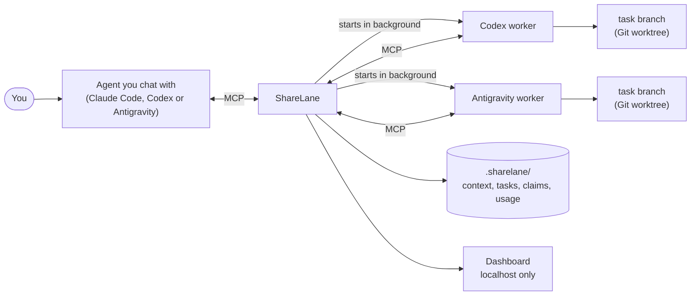

# ShareLane

ShareLane is a local, open-source hub that lets coding-agent CLIs share one project memory and hand work to each other. Claude Code, Codex and Antigravity CLI (`agy`) all connect to it over MCP. From whichever agent you are chatting with, you can delegate a task to another one. It runs in the background on its own Git branch, inside the folders you allowed, and if that agent runs out of allowance another one picks up where it stopped. Everything uses your own subscription logins. There are no API keys and no cloud service.

> **Status:** early (v0.1). Tested on Windows 11, with CI on Windows, macOS and Linux. Install with `npm install -g sharelane`; see [Quick start](#quick-start).

## Why

If you use more than one coding agent, you probably run into these problems:

- **Lost context.** Each tool keeps its own notes. When you switch from Claude to Codex, you explain the project again.
- **Collisions.** Two agents edit the same file, or redo each other's work.
- **Running out mid-task.** An agent hits its usage limit halfway through, and you have to work out what it finished and brief another agent by hand.

ShareLane gives all of them one shared notebook for the project and one place to hand off work, with guard rails.

## Features

- **Shared context, loaded in small pieces.** A short `MAP.md` plus topic chunks (architecture, API, UI…), full-text search (SQLite FTS5), and "stale" flags when the files a chunk describes have changed since it was written.
- **Delegation in any direction.** Any agent can start another in the background. You get a task ID right away, then `status`, `wait`, `reply` (continues the same session) and `cancel`. Depth and loop limits stop agents from delegating in circles.
- **Isolated branches.** Each delegated worker runs in its own Git worktree and returns a `sharelane/task-*` branch for you to review. Nothing is merged automatically.
- **Collision protection.** Agents claim files before editing. Claims expire, overlapping claims are refused, and similar duplicate tasks get a warning. An edit-guard hook blocks unclaimed edits in Claude Code and Antigravity, and Git detection catches edits from anything else.
- **Scoped tasks.** "Codex may only change `src/ui/**`." Enforced with each CLI's own permission controls where they exist, and otherwise by keeping out-of-scope changes off the branch.
- **Usage, quota and handoff.** Token use is recorded for every run. Before each run, ShareLane checks the agent's remaining allowance. At 7% or less, or when a run fails because the agent ran out, it saves the work, writes a handoff note and passes the task to another agent on the same branch. ("Could not tell" is reported, never treated as "fine", but it does not block a run on its own.)
- **Token budgets** per task.
- **Approved checks (`run_check`).** Agents can ask ShareLane to run commands you approved, such as `npm test`, without getting a terminal.
- **Right model for each task.** Whoever hands out work picks how hard it is (fast, balanced, or strong), or lets ShareLane guess from the wording, and each agent runs on the matching model: Claude Haiku, Sonnet, or Opus; Antigravity Gemini Flash or Pro; Codex Luna, Sol, or Astra. Edit the mapping in `agents.yaml`.
- **Live office dashboard.** A local page that shows your agents as employees in a pixel-art office: at their desk when working, at the review board when finished, in the meeting room when they need you. Click one to read its conversation and live output, and to pause, resume, stop, message, or assign it work. A Details tab has the tables: tasks, claims, allowance meters, token use, and the context map.

## How it fits together



Each agent starts its own copy of the ShareLane MCP server. The copies share one SQLite database in the project's `.sharelane/` folder, so there is no background service to keep running.

## Quick start

### Requirements

- Node.js 24 or newer
- Git
- At least one of these, installed and logged in with your subscription: [Claude Code](https://code.claude.com/), [Codex CLI](https://github.com/openai/codex), Antigravity CLI (`agy`)

### 1. Install

Install ShareLane once per computer:

```sh
npm install -g sharelane
sharelane --help
```

A global install gives Codex, whose ShareLane entry is shared by all your projects, one stable path to start it from.

**Teams:** if teammates will use the same repo, also add ShareLane to the project with `npm install --save-dev sharelane`. The generated agent configs then point into the project's `node_modules`, so they work on every clone. Run commands with `npx sharelane …` in that case.

### 2. Set up your project

Go to your project folder (not your home folder or `C:\Windows`). It must be a Git repository with at least one commit, because delegated workers branch from it:

```sh
cd path/to/your/project
git status                       # "not a git repository"? run the next three lines
git init
git add -A
git commit -m "initial commit"

sharelane init --yes
```

`init` looks for Claude Code, Codex and Antigravity and connects each one it finds:

- **Claude Code:** writes the project `.mcp.json`, the edit-guard hook and a usage status line (which keeps showing your own status line). Claude asks you once to approve the project's MCP server. **Commit `.mcp.json`**: delegated Claude workers read it from their task branch.
- **Codex:** keeps its MCP servers in your global config (`~/.codex/config.toml`). With `--yes`, `init` registers ShareLane there and lets headless Codex workers call ShareLane's tools without a prompt (`default_tools_approval_mode = "approve"`).
- **Antigravity:** writes `.agents/mcp_config.json` and its hook. Its permission rules are global only, so with `--yes`, `init` adds the allow rule `mcp(sharelane/*)` to `~/.gemini/antigravity-cli/settings.json`.

Without `--yes`, `init` changes nothing outside the project and prints the global steps for you to do instead.

It also creates `.sharelane/` with a starter context map and `.sharelane/checks.json` (see [Configuration](#configuration)), adds ShareLane's instructions to `AGENTS.md` and `CLAUDE.md`, and adds its runtime files to `.gitignore`.

At the end, `init` lists what it did, anything still to do, and what to commit when you share the repo. **Restart** any agent already open in the project so it loads ShareLane, then ask it to "fill in the ShareLane context for this project": the starter chunks are empty, and filling them in gives every agent the same overview.

### 3. Delegate your first task

Open the agent you normally use and ask in plain words. For example, in Claude Code:

> Use ShareLane to delegate to Codex: "add a dark-mode toggle to the settings page". Scope it to `src/ui/**` and give it a budget of 200k tokens.

Claude calls ShareLane's `delegate` tool and gets a task ID back right away. You can keep chatting. Ask "what's the status of that task?" or "wait for it", or send a follow-up with "reply to the task: also add a test". The same works from Codex or Antigravity: any of them can delegate to any other.

To check that an agent is set up, you can also run it once from the terminal. This runs it directly in the current folder and waits for its answer; it is not a delegated task (no task branch, claims or handoff):

```sh
sharelane run codex "say hello and list the ShareLane tools you can see"
```

### 4. Watch it

```sh
sharelane dashboard --open
```

This opens `http://localhost:4317/`: the office view, where each running agent is an employee you can click to read its conversation, check its output, pause, stop or reply. A details view shows claims, allowance meters, tokens per agent, and which context chunks are stale.

### 5. Review the result

When the task finishes, its work is on a branch such as `sharelane/task-1a2b…`. Review and merge it like any other branch:

```sh
git log --oneline main..sharelane/task-1a2b...
git diff main...sharelane/task-1a2b...
git merge sharelane/task-1a2b...   # only if you're happy with it
```

### More projects

Run `sharelane init --yes` once in each project. Each project gets its own `.sharelane/` folder, so context, tasks, claims and branches never mix between projects. What is shared across projects is the agent CLIs, your logins and subscription allowance, Codex's global ShareLane entry and Antigravity's allow rule.

Start your agents from the project folder: ShareLane finds the project from the folder each agent runs in. To watch two projects at once, give the second dashboard another port: `sharelane dashboard --port 4318 --open`.

### Updating

```sh
npm install -g sharelane@latest
sharelane --help
```

Every project uses the global install, so one update covers them all. If a release changes setup, run `sharelane init --yes` again in each project; it is safe to re-run and keeps your context and settings.

### Resetting or removing ShareLane from a project

Close any agents running in the project first.

**Start fresh** (forget tasks, conversations, claims and notes, keep the written context):

```powershell
# PowerShell
Remove-Item -Recurse -Force .sharelane\sharelane.db*, .sharelane\runs, .sharelane\tasks, .sharelane\journal, .sharelane\notes.txt -ErrorAction SilentlyContinue
sharelane init --yes
```

```sh
# macOS / Linux
rm -rf .sharelane/sharelane.db* .sharelane/runs .sharelane/tasks .sharelane/journal .sharelane/notes.txt
sharelane init --yes
```

To reset the context too, delete the whole `.sharelane/` folder before running `init`.

**Remove it completely:**

1. Delete `.sharelane/`, `.agents/mcp_config.json`, `.agents/hooks.json`, `.claude/hooks/sharelane-claim-guard.mjs` and `.claude/hooks/sharelane-statusline.mjs`.
2. Remove ShareLane's parts, and only those, from files that may hold your own settings:
   - `.mcp.json`: the `sharelane` entry under `mcpServers`
   - `.claude/settings.json`: the hook that runs `sharelane-claim-guard` and the `statusLine` that runs `sharelane-statusline`
   - `AGENTS.md` and `CLAUDE.md`: everything between `<!-- sharelane-context:start -->` and `<!-- sharelane-context:end -->`
   - `.gitignore`: the `# ShareLane local runtime` block
3. Merge any `sharelane/task-…` branch you want to keep, then run `git worktree prune` and delete the rest with `git branch -D <name>`.

The global settings serve every project, so leave them unless you are removing ShareLane from your computer entirely. In that case, also run `codex mcp remove sharelane`, remove `mcp(sharelane/*)` from `~/.gemini/antigravity-cli/settings.json`, and run `npm uninstall -g sharelane`.

### Troubleshooting

- **`EPERM: operation not permitted, mkdir 'C:\Windows\.sharelane…'`:** `init` sets up the folder you are in. `cd` into your project first.
- **PowerShell says "running scripts is disabled" for `npm`, `npx`, `codex` or `sharelane`:** run `Set-ExecutionPolicy -Scope CurrentUser RemoteSigned` once, or call the `.cmd` versions (`npm.cmd`, `sharelane.cmd`).
- **`npm warn allow-scripts … esbuild`:** harmless. esbuild's platform binary is installed anyway; to silence the warning, run `npm config set allow-scripts=esbuild --location=user`.
- **`sharelane` is not recognized:** the global install is missing or npm's global folder is not on `PATH`. Run `npm install -g sharelane`, then open a new terminal.
- **An agent doesn't see ShareLane's tools:** restart it from the project folder. For Claude Code, approve the `sharelane` MCP server when asked. For Codex, re-run `sharelane init --yes`.

## How it works

**Shared context.** Agents read `.sharelane/context/MAP.md` first. It is a short index of chunks, each with a "read this when…" line. They open only the chunks they need, or use `search`. After meaningful work, an agent updates the chunks it affected with `update_chunk`. Chunks are size-capped, and a chunk is marked stale when the files it covers change. The curated Markdown is meant to be committed; the database and raw logs stay local.

**Delegation.** `delegate(agent, task, scope?, budgetTokens?)` starts the other agent's CLI in headless mode (for example `codex exec` or `claude -p`) in a fresh worktree and returns a task ID. The worker connects back to ShareLane over MCP, so it sees the same memory and claims. `reply` resumes the same worker session instead of starting over. Delegation chains are limited to depth 3, and an agent cannot delegate back into its own chain.

**Scopes.** A scope is a list of project-relative paths or globs. ShareLane claims the scope for the task (refusing if someone else holds an overlapping claim), then translates it into each CLI's strongest control. For Claude Code, edits outside the scope are not pre-approved and so are denied. For Codex, the sandbox is rooted at the scope's folder. For Claude Code and Antigravity, the edit-guard hook also rejects out-of-scope edits. Finally, when the work is saved, any change outside the scope is written to a `.patch` file, restored, and kept off the task branch.

**Handoffs.** Before every run, ShareLane asks how much allowance the agent has left. Codex is read from its local session logs. Claude is read from a status-line snapshot, with a fallback described under [Safety](#safety-model). Antigravity has no reader, so its limit errors are the signal. If the lowest window is at 7% or below, a run fails with an allowance error (out of credits, usage or rate limit), or the worker replies `HANDOFF:` after checking its own usage, ShareLane:

1. commits the work so far to the task branch,
2. writes `.sharelane/tasks/<task>.handoff.md` (the request, progress notes, files changed, last reply, reason),
3. gives the task to another agent that has not tried it yet and is not itself low, on the same branch. At most two reassignments per task; otherwise the task waits as `needs_reassignment` and you can `reassign` it by hand.

**Budgets.** `budgetTokens` caps fresh tokens (new input plus output) across all runs of a task, including replies and reassignments. You get a warning at 80%, and nothing new starts once the budget is used up. Token counts arrive when a run ends, so a single run can go over. The budget stops the next run, not the current one.

**Approved checks (`run_check`).** Delegated Claude workers get no terminal, and Antigravity cannot run commands in headless mode. They can still run tests through `run_check`, which runs only commands listed in your project's `.sharelane/checks.json`, inside the task's worktree (so it sees the worker's uncommitted edits), with a time limit, and returns the last 8 KB of output. The list is always read from your main project checkout, so a worker cannot approve new commands by editing its own copy. **It is not a sandbox:** `npm test` runs the project's test code, which an agent may have written or changed.

## Safety model

- **Local only.** All state is in your project's `.sharelane/` folder. The dashboard listens on `127.0.0.1` and answers only `localhost`. Its controls work only from the page itself: each request needs a random token that other websites cannot read, plus a matching Origin.
- **No API keys.** Agents run through their official CLIs, logged in with your own subscription. ShareLane does not store credentials.
- **One exception, optional:** when the saved Claude status-line snapshot is more than 15 minutes old, ShareLane may read Claude Code's sign-in token into memory to make one read-only call to Anthropic's usage endpoint (at most once every 5 minutes). The token is never written anywhere. Turn this off with `SHARELANE_CLAUDE_USAGE_ENDPOINT=0`; Claude's quota then shows "could not tell" when the snapshot is stale.
- **Nothing is merged for you.** Workers edit isolated worktrees and leave branches. You decide what reaches your main branch.
- **Layered collision protection.** Expiring claims, the edit-guard hook (Claude Code and Antigravity), and Git detection with notices for edits the hook cannot see (Codex, shell commands).
- **No terminal for constrained workers.** `run_check` runs only command lines you listed, taken from your own checkout. Those commands still execute project code (tests, scripts) that an agent may have edited, so it limits *which commands* run, not *what the code does*.

## Configuration

**Agent adapters: `src/adapters/agents.yaml`** (inside the installed package; point `SHARELANE_AGENTS_CONFIG` at your own copy to change it). Each agent is a config entry: the command and arguments to run and resume it, how to translate a scope into its flags, which quota reader to use, and where its MCP config lives. Adding a new agent CLI is mostly a new entry, plus a small output parser in `src/adapters/result.ts` if its output format is new.

**Approved checks: `.sharelane/checks.json`.** `init` fills this from your `package.json` `test`, `typecheck` and `lint` scripts. Edit it to add, change or remove commands. Only commands listed here can be run through `run_check`.

**Environment variables.**

| Variable | Effect |
|---|---|
| `SHARELANE_CLAUDE_USAGE_ENDPOINT=0` | Never read Claude's token for the usage fallback |
| `SHARELANE_AGENTS_CONFIG=<path>` | Use your own adapters file instead of the bundled `agents.yaml` |

## Known limitations

- **Antigravity headless cannot run terminal commands** unless its sandbox is set up (a one-time administrator approval on Windows) or you allow unsandboxed commands. Out of the box, Antigravity workers use file tools, ShareLane tools and `run_check` only.
- **The Codex sandbox is folder-level.** A file glob inside a folder is enforced by claims and by keeping out-of-scope changes off the branch, not by Codex itself.
- **Budgets are enforced between runs,** not mid-run.
- **Antigravity has no allowance reader;** ShareLane learns it is out when a run fails.
- **Windows-first.** Developed and tested on Windows 11. It is written to be portable, but macOS and Linux have had less testing.
- **No direct agent-to-agent chat.** Agents coordinate through tasks, replies, claims and shared context, not free-form messages.
- **Depends on CLI behaviour.** Scope enforcement relies on flags and hooks in each CLI; re-check after major CLI upgrades.

## How ShareLane differs

Other tools run agents in parallel (claude-squad, Conductor, Vibe Kanban), let agents message each other (MCP Agent Mail, Neohive), or let one agent call another (PAL MCP's `clink`, mcp-agents). See [docs/PRIOR_ART.md](docs/PRIOR_ART.md) for an honest comparison, including where those tools are stronger.

## Contributing

Issues and pull requests are welcome. Before a large change, open an issue to discuss it. The design is in [docs/DESIGN.md](docs/DESIGN.md) and the reasons behind decisions are in [docs/DECISIONS.md](docs/DECISIONS.md).

```sh
git clone https://github.com/Two19Labs/Sharelane-by-Two19-Labs.git sharelane
cd sharelane
npm install
npm test
npm run typecheck
npm link        # puts your working copy on PATH as `sharelane`
```

`npm link` replaces the global install; run `npm install -g sharelane` to go back to the published version.

Adapters for more agent CLIs are especially welcome.

## License

[MIT](LICENSE) © Manthan Kabra
